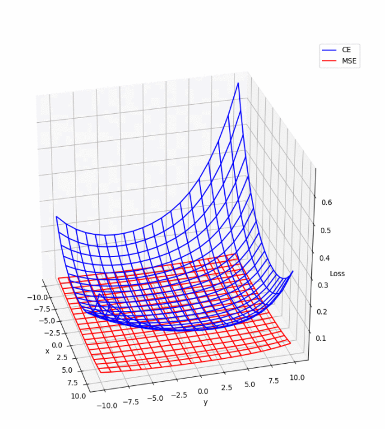
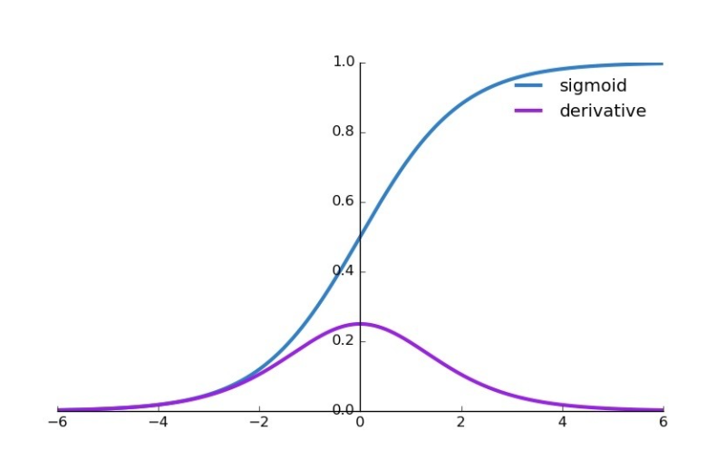
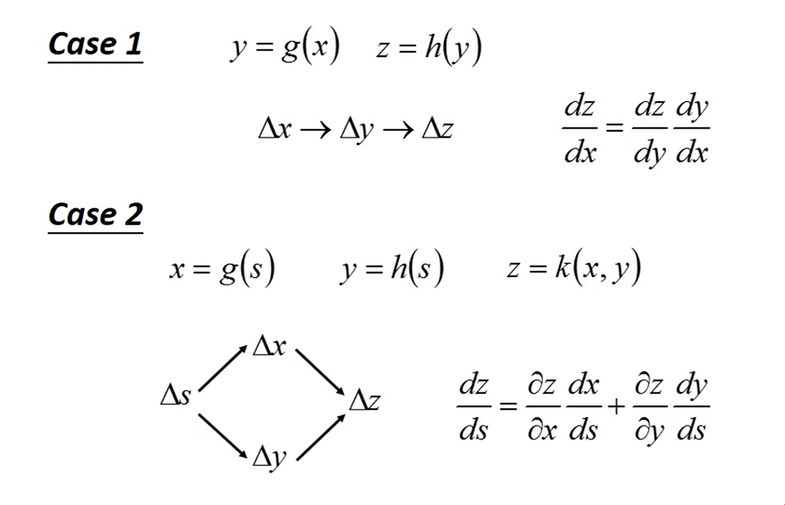
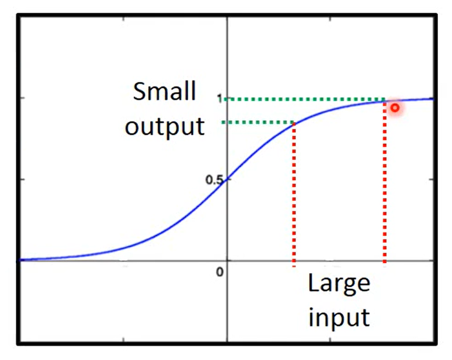
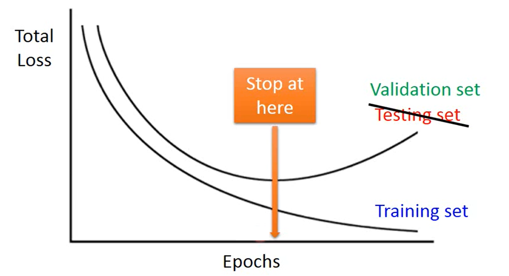
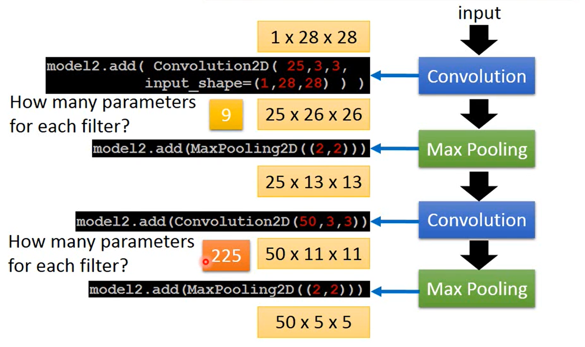
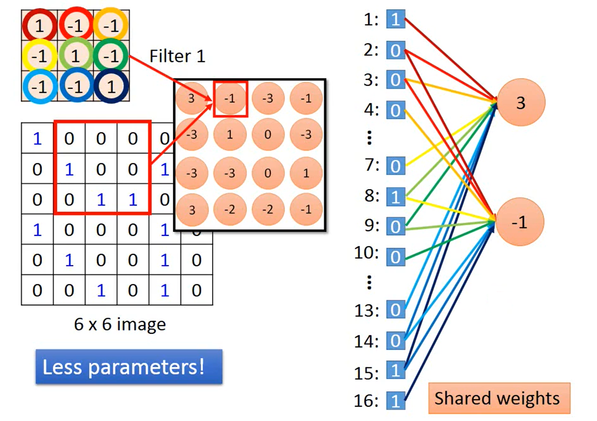

### Bias 和 Variance

同一个模型对于不同的训练数据集可以训练出多个不同的参数集合，这些带参模型之间的差异叫做 Variance，它们的 mean 与理想模型的差叫做 Bias 。

当模型函数越复杂，能够表示的函数集合也就越多，针对不同的训练数据就更有可能出现训练数据上的过拟合，从而每一组之间就可能千差万别，从而 Variance 较大；但因为函数集合很大可能涵盖了理想模型，所以当训练数据足够多时各个模型的期望就更贴近理想模型，从而 Bias 较小。而当模型越简单，能够表示的函数集合有限，出现过拟合的可能性不大， Variance 较小；但同样因为函数集合有限，很可能涵盖不了理想模型，无论怎样拟合都与理想模型有一定差距，从而 Bias 较大。

减小 Variance 的方法：

- 增加训练数据（很有效但往往难以实现）
- 引入 Regression 用于惩罚太过复杂的函数，避免过拟合

减小 Bias 的方法：

- 重新设计模型，考虑更多更复杂的因素

### Regression

在 Loss function 后面加一个正则项，用于减弱**过拟合**，提高模型的泛化能力。假设原函数是 $f(x)=wx+b$ 的形式，那么正则项为 $\lambda \sum{(w_i)^2}$ 。$\lambda$ 是一个手动调节的超参；当 $w$ 这个参数越大（可以理解为原函数越复杂），则加入 Loss 中的惩罚因子越大。这可能会影响 bias ，不过在处理 variance 过大的情况效果较好。

### Loss Function

Loss function 为损失函数，负责评价一个函数的好坏，并且应该具有连续可微的性质以便给出原函数的调整策略。Loss function 有以下几种：

1. Mean Squared Error （MSE，均方误差）
   顾名思义，即每个训练集上的样本真实值与预测值先差再平方最后取平均（均方误差倒过来就是计算步骤）。属于比较简单的一种算法，常用在各种机器学习模型里（比如最简单的 $y=wx+b$ 线性回归）

   > 不过 MSE 有一个显著的缺点：在处理**分类问题**中，一般分类的依据都是函数的输出是一个 N 维向量对应 N 个类别，向量里的哪个分量最大就取哪个类（最大似然估计）。而当分类错误时， MSE 对函数的惩罚仅限于一个二次项，这是远远不够的（对比后面介绍的交叉熵损失（ Cross Entropy，CE ）会直接趋向于无穷大，二者的对比见下图）。
   > 
   >
   > 这个问题当使用 Sigmoid 或 Softmax 作为激活函数时尤其明显。因为函数得到的数值要经过激活函数处理，而这两个函数得到的结果在接近 0 和 1 时的偏导数值很小（如下图）。而刚开始训练的模型经过激活函数的输出都会集中在 0 和 1 附近，配合 MSE 时会出现会出现学习速率极其缓慢，也被称为「梯度消失」。解决「梯度消失」的方法就是更换 Cross Entropy 作为 Loss function 。
   >
   > 

2. Classification Error （分类误差，或分类错误率）
   因为在分类任务中不适合使用均方误差（因为会惩罚「过于正确」的样本， Classification 节会提到），所以这里采用二值来统计**被分类错误的样本占总样本数的百分比**，称其为 Classification Error。计算起来比 MSE 还简单，适用于分类任务。

3. Cross Entropy Loss Function （交叉熵损失）
   $$
   \begin{array}{l}
   	L_i & = & \sum_c^M\sigma(\hat{y_i}=c)\log(P(\hat{y_i}=c)) \\
   	L & = & \sum_i
   \end{array}
   $$
   其中 $L_i$ 是对于训练数据中单独一个样本产生的交叉熵损失，总的交叉熵损失 $L$ 即为把所有样本的加起来。 $M$ 是类别数量， $\sigma$ 为一个符号函数，当 $\hat{y_i}=c$ 即对第 i 个样本的预测类别正确时

   比如在一个图像分类任务里面，

### Gradiant Descent

Gradiant Descent 的步骤很简单不提了，以下为几个小 Tips：

#### Adaptive Learning Rate

顾名思义，不同于传统的 Learning rate 值为常数的情况，这里的 Learning Rate 是可变的，会随着学习过程动态适应。

- Adagrad：思想是考虑 Gradiant 的导数，也就是原函数的二阶导，从而决定学习的「加速度」。实际情况下，计算二阶导并不容易，所以这里采取了一种近似估计，通过计算过去所有梯度的平均值来估计二阶导的绝对值数值大小（还有一种理解方法认为它更关注函数的「突然变化」，如果这一次变化的函数值比以往的都要小，那可能是快接近终点了， Adagrad 就会以更慢的速度靠近）。实际公式如下：
    $$
    \begin{array}{cc}
        w^{t+1} &\leftarrow& w^t - \frac{\eta^t}{\sigma^t}g^t \\
        \eta^t & = & \frac{\eta}{\sqrt{t+1}} \\
        \sigma^t & = & \sqrt{\frac{1}{t+1}\sum^t_{i=0}(g_i)^2}
    \end{array}
    $$
    其中 $\eta$ 是一个随时间逐渐变小的参数，而 $\sigma^t$ 是以前求出来所有的 Gradiant 的 Root Mean Square （平方均值，英文从右往左就是计算步骤，先 Square 再 Mean 最后 Root ，注意 Mean 取的是 t+1 因为要避免第一次 t=0 的情况）

- Root Mean Square Property（RMSProp）：是在 Adagrad 基础上的优化，加入了一个全局学习率因子，从而修正了连续梯度下降中的摆动，使得梯度下降路径基本沿一条直线，方向上不会有太大的变化，提高了学习速度
  
- Adam ：这是目前应用最广泛的一种算法。结合了 RMSProp 和 Adagrad 的精髓，大致思想是把 Gradiant Descent 看作一个小人下山的过程，每次更新当前位置的操作看成物理学意义上的位移，并计算在这个过程中的「动量」。注意到物理学上位移并不是直接由赋予速度造成的，而是对一个质点施加一个力的作用产生加速度，所以速度不会有突变；同理在小人下山的过程中也不应该有太过突然的变化，应该保持一种「惯性」：它考虑过去一段时间内的运动情况，在原有运动方向上加入新 Gradiant 的修正，从而得到新的位置。

	- 具体计算时，它会在算出过去的运动情况后乘以一个小于 1 的因子，下一次计算位置时直接使用这个因子加上新的值再乘以一个因子，这就会使越早的运动对现在的影响越小，比较符合直觉。
	
	> 这个理解就好，应该不会考公式；公式太难了大家都背不过，要挂大家一起挂 

#### Stochastic Gradiant Descent

一种加速 Gradiant Descent 的方法。以往计算 Loss function 时都是对所有的训练样本计算 Loss 之后求 Mean ，而 Stochastic Gradiant Descent 是每计算一个训练样本就根据当前值的 Loss 走一小步，有多少个训练样本就可以走多少步，从而大大加快 Descent 的速度。

#### Feature Scaling

如果给定的 $x$ 是向量有多个指标（ $x_1,x_2\cdots$ ），而这些指标之间的数量级差别很大（例如 $x_1$ 都是 1，2，3 这样的个位数，而 $x_2$ 都是 100，200，300 这个数量级的），那么可以对它们分别做变换，使得它们的 $\mu=0$ 且 $\sigma=1$ ，具体变换方程如下：
$$
x^r_i \leftarrow \frac{x^r_i+\mu_i}{\sigma_i}
$$
为什么 Gradiant Descent 之前要做 Feature Scaling ？根本原因是：椭圆上的法线并不指向椭圆的圆心，最开始进行 Gradiant Descent 的方向会有偏差，从而浪费步数。

#### Gradiant Descent 的缺陷

理想情况下会停在 Gradiant 等于 0 的位置，但这个位置并不一定是全局最优点，有可能是 Local minimum，还有可能只是「高原」上的一个点。

当前在 Linear Regression 中的 Loss function 是 convex 的（直译叫做「凸函数」），所以只存在一个 Local minimum ，同时这也是全局的最优点，所以当前不存在这个问题。

这个问题在后续解决方法，一是调整合适的学习率，二是采用前面说的各种优化方法，有一个比较经典的优化叫 Adam ，采用了一种类似 monument 动量的思想，储存了沿梯度下降过程中的「惯性」。

### Classification

$$
f(x)=Class: R
$$

首先： Classification 不能硬当作 Regression 来做，因为模型预测的输出会是实数域的，而我们期待的输出可能只有有限的几个数字（比如 0 和 1 ），所以它把「太过于正确」的值视为有害的而调整模型，从而得到不准确的 Boundary。因此模型和 Loss function 都需要调整，模型可以设定为「当某个值满足一定条件时分为某一类」的形式， Loss function 可以设定为「在训练集上分类错误的次数」，从而得到较好的结果。

==后面的概率模型还没看==

### Neural Network

### Activation Function

激活函数是在每一个网络层输出前额外增加的一个一元函数，目的是让整体函数变得非线性化（如果不加入 Activation function ，则整个网络结构实际上可以表示为一个线性函数式，这就失去了构造多层神经网络的意义）；同时也有借鉴生物学的因素，生物上神经信号不是线性的，而是有明显的「激活」与「未激活」两种状态。

通常采用 Sigmoid ，在多层网络中也有采用 ReLU 、 Maxout ，在分类任务中常用 Softmax 。

### Back Propagation

Back Propagation （反向传播）本质只是一种比较高效地计算 Gradiant Descent 的方法。因为在复杂的神经网络模型中，函数的参数有成千上万个，对于每个来单独计算偏微分十分复杂，所以引出 Back Propagation 。

#### Chain Rule

实际上就是高中就学过的链式求导法则，公式如下：

神经网络的构造形式很类似： 
$$
z=w_1x_1+w_2x_2+w_3x_3\cdots +w_nx_n+b \\
c=A(z)
$$
其中 $A$ 表示激活函数，可能是 softmax 、 ReLU 之类的。

#### Forward Pass 与 Backward Pass

类比一下线性回归中的 Gradiant Descent 的方法，我们想让 Loss function 最小，所以我们要对 Loss function 求导找出它的变化规律；而要想改变 Loss function 的值，我们只能通过调整网络中的 $w$ 等这些参数来改变：所以我们实际上要求的是 Loss function 的值（以下简写作 L ）对参数 $w$ 的偏导数 $\frac{\partial L}{\partial w}$ 。

因为在一个神经元中，正向传播计算结果可以看作两步：第一步是由上一层的输入 $\vec{a_1}$ 乘上 $\vec{w}$ ，得到 $\vec{z}$ ；然后 $\vec{z}$ 经过 Activation function 激活函数输出结果 $\vec{a_2}$ 进入下一层。

由此， $\frac{\partial L}{\partial w}$ 可以拆成两部分： $\frac{\partial L}{\partial w} = \frac{\partial z}{\partial w}\cdot\frac{\partial L}{\partial z}$ 。

- 其中前一项 $\frac{\partial z}{\partial w}$ 即为当前这层网络的输入 $\vec{a}$ （ $\vec{z} = \vec{a}\vec{w}$ ， $\frac{\partial z}{\partial w}= \vec{a}$ ）；
- 而后一项 $\frac{\partial L}{\partial z} = \frac{\partial a}{\partial z}\cdot\frac{\partial L}{\partial a}$ ： $\frac{\partial a}{\partial z}$ 是激活函数的导数，知道激活函数就能知道这个值；而 $\vec{a}$ 不仅是这一层的输出，还是下一层的输入，所以可以看作 $\frac{\partial L}{\partial a'}$ ，而这又可以拆为 $\frac{\partial L}{\partial a'} = \frac{\partial z}{\partial a'}\cdot\frac{\partial L}{\partial z'}$ （注意这是 L 对 a 求偏导，而不是 L 对 w ）， $\frac{\partial z}{\partial a'}$ 显然等于下一层的 $\vec{w'}$ ，而 $\frac{\partial L}{\partial z'}$ 又可以视为激活函数的导数乘以下下层的输入……直到某一层就是输出层，这一层的输出结果 $\vec{z}$ 将直接决定模型的输出 $\hat{y}$ ，通过 $\hat{y}$ 与 $y$ 真实值比较得到 Loss function，即 $L=f(\hat{y}, y)$ 。所以这一层的 $\frac{\partial L}{\partial z} = \frac{\partial \hat{y}}{\partial z}\cdot\frac{\partial L}{\partial \hat{y}}$ ： $\frac{\partial \hat{y}}{\partial z}$ 还是激活函数的导数，后一项是 Loss function 对输入结果的偏导数，这两项都已知可求。

所以这两部分也对应着不同的算法：

- 前一项需要知道的信息就只有当前这层网络的输入 $\vec{a}$ ，而这需要前一层网络输出得到；要得到前一层网络的输出，就需要给定前前一层网络的输出来计算，直到第一层的输入直接是训练集的样本 $\vec{x}$ 。这是一个从前向后的过程，称为 **Forward Pass** 。
- 后一项要知道的信息，除了 Activation function 和 Loss function 这两个常量（确定了采用哪种激活函数哪种损失函数之后接着可以算出来，而且常见的激活和损失函数都被设计的导数十分简单易求），还有就是 L 对 每一项输出的偏导。根据上述分析，这个偏导需要用到后一项的偏导，而后一项又用到后后一项，直到最后一层的输出是两个常数项相乘。这是一个从后向前的过程，称为 **Backward Pass** 。

Back Propagation 算法就是由 Forward Pass 和 Backward Pass 两部分组成。

### Model Improvement

在 Training set 上结果不好可能因为：

- 网络架构设计不合理 $\Rightarrow$ 重新设计网络结构（换用更复杂的模型）

  - 网络层数太多，导致前面的 Derivative 很小，每次更新对前几层几乎没有影响，最终网络前几层参数几乎都是随机数，而后几层参数优化已经接近饱和（再怎么更新也没法更进一步优化结果）。这被称为「梯度消失」

    > 为什么会出现这种现象？往往是激活函数的问题
    >
    > 直观上来看，「梯度（或者叫偏导数）」反映了改变这个参数会对最终的结果（ Loss function ）产生多大的影响。而 Sigmoid 激活函数的出现会削弱这种影响，并且每经过一层都会削弱一次，导致层层衰减，最后偏导数已经小到几乎为 0 。
    >
    > 
    >
    > 那么解决的方法自然就从激活函数入手。介绍几种不会出现「梯度消失」的 Activation function
    >
    > - ReLU（Rectified Linear Unit）：小于 0 的输入归零，大于 0 的输入不变
    >   - Leaky ReLU ：小于 0 的输入缩小 100 倍后输出，大于 0 不变
    >   - Parametric ReLU ：小于 0 的输入乘以 $\alpha$ 后输出（ $\alpha$ 是一个模型学习得到的参数值），大于 0 不变
    > - Maxout ：对每一层输入的参数预先分组，每一组中只取最大的输出（类似 Pooling 池化）
    >   - Maxout 可以实现 ReLU 的效果

  - 激活函数设置不合理 $\Rightarrow$ 重新设计激活函数

- 只收缩到了 Local minimum $\Rightarrow$ 采用 Adaptive Learning Rate ，例如 Adam

  - 实际上不用太过于担心 Local minimum 的问题，在大多数碰到的模型中都只会有唯一的 Minimum 。可以这样解释：出现 Local minimum 只可能是函数的每一维在这个点都出现「山谷」，而成千上万维的网络模型中每一维都出现的概率是非常低的，所以大可以不用太担心

在 Training set 上结果不错，但在 Testing set 上结果不好可能因为：

- Overfitting 过拟合 $\Rightarrow$ 减弱过拟合
  - 加入正则项 Regularization
  
    - 类似前面机器学习上的 Regularization ，这里也可以类似的加入正则项以避免模型太过复杂。一般采用参数的 L2-norm ，即对于参数集$\theta=\{w_1, w_2, \cdots, w_n\}$ ，正则项 $\norm{\theta}_2=(w_1)^2+(w_2)^2+\cdots+(w_n)^2$ ；注意这里也不要加偏移项项 $b$ 
  
      > 注： L1-norm 即曼哈顿距离， L2-norm 即欧几里得距离
  
    调整减少训练轮数
  
    - 一般情况下，随着训练轮数的增加， Training set 上的 Loss 是在逐步减小的；但我们要找到是能使 Testing set 上的 Loss 最小的训练轮数并停在这里；这里往右会过拟合，往左会欠拟合。但是我们不知道真正 Testing set 的分布，也不能拿 Testing set 来筛选模型；我们能做的只有在 Training set 上额外切出一部分来做 Validation set ，模拟 Testing set 的分布情况，从而避免过拟合的发生。这里也可以使用 Cross validation （交叉验证）等方法。
      
  
  - 重新设计简单的模型
  
- 设置 Dropout

  - 操作过程：
    - 在 Training 时，每个节点有 $p\%$ 的几率被「丢掉（ Dropout ）」。被「丢掉」的节点失去作用，同时所有于它相连的边也会失去作用，这导致整个模型变轻。
    - 在 Testing 时，不进行任何「丢掉」操作；同时每个节点得到的权重 weight 要乘以 $(1-p\%)$ 。
    
  - Dropout 仅适用于 Training 结果好而 Testing 结果不好的情况。加上 Dropout 会使 Training 时的结果变差，但是有可能会改善 Testing 时的结果。可以形象化地理解为「负重训练」，在训练的时候背上五公斤沙袋跑步，到比赛的时候卸下沙袋就能变得身轻如燕。
  
    > 这里李宏毅老师举的例子是，在做小组作业的时候如果大家一起做，经常会有滥竽充数的，大家都寄希望于别人能好好做而自己摆烂，最后就都完成不好；但是如果一个一个抽查，每次只挑选少数几个人来完成，那每个人都必须特别卷要不就很容易被抓出来挂科。十分生动形象~
  
  - 如何理解 Testing 的时候每个节点的权重 weight 要乘以 $(1-p\%)$ ？也可以形象化地理解，当 $p\%$ 的节点被「丢掉」，而只有 $(1-p\%)$ 的节点起作用时，最后算出的结果是准确的，也就是说每个节点发挥了 $\frac{1}{(1-p\%)}$ 的作用。当 Testing 的时候，所有节点都在工作，那么所有节点加在一起，最后结果的期望就是 $1\times\frac{1}{(1-p\%)} = \frac{1}{(1-p\%)}$ 。为了让这个结果回归到 1 ，就需要乘以 $(1-p\%)$ ，从而得到要为每个节点的权重 weight 乘以 $(1-p\%)$ 。这样理解可能有些漏洞，但是大致就是这个意思。

### Convolutional Neural Network

卷积操作比较简单， CV 课上也学过，就不说了。

模型的结构一般是 Input $\rightarrow$ Convolution（卷积） $\rightarrow$ Pooling（池化） $\rightarrow$ Convolution（卷积） $\rightarrow$ Pooling（池化） $\rightarrow$ $\cdots$（可能会重复好多次） $\rightarrow$ Activation Function $\rightarrow$ Output 。

卷积常用于处理图像识别问题。

> 为什么图像识别问题要用卷积神经网络？除了众所周知的图像的输入参数多、图像存在降低分辨率后信息损失很小等因素以外，还有一条我自己的理解：
>
> 注意到图像中包含的一些 Pattern 不一定处在图像的哪个位置。比如一张图片上有一朵花，但是花出现在左上角也叫花，出现在正中间也叫花，怎么把这些情况都纳入模型的考虑范围？如果换做一般的网络架构，可能会针对左上角设置一个检测花的神经元，针对中间设置一个神经元，针对各个位置都有检测花的神经元，这就会让训练过程非常麻烦，同时网络也会有浪费（因为逻辑上存在冗余的节点）。而 CNN 则不同，可以理解为卷积核上就隐含了一朵花的模板，在卷积的过程中，这个蒙版会在**整个图像可能的位置都扫一遍**，如果在某个位置上出现了与模板匹配度很高的区域，那就会在卷积的输出结果层中输出一个比较大的值，从而在 Pooling 过程中被凸显出来，达到「辨识」的目的。而这就恰好利用了卷积运算的特性，使用一个卷积神经元就完成了任意位置的 Pattern 的识别。

**注意**：在经过第一次卷积后，比如有 20 个卷积核，那就会得到 20 张卷积后的图像，池化后还是 20 张图像；那下一层假如说有 30 个卷积核，会对上一层的每个图象都做卷积运算，最后得到 20×30=600 张图像吗？答案是否定的。**上一层的卷积图像数量将作为下一层的通道数，而一个卷积核会对考虑所有的通道，最后加权并得到一个数。**例如最开始是 3 个通道（ RGB ），经过 20 个卷积核的卷积运算，得到一张有 20 个通道的图片；在第二层的卷积运算中， 30 个卷积核每个卷积核在做运算时都会考虑到上一层输入图像中的 20 个通道，每次卷积运算都将这 20 个通道合起来考虑并得到一个数值；最终得到一张有 30 个通道的图片。可以参考下图中的向量大小变化。==这里的运算过程我还没完全搞明白。有三维的向量如何与卷积核做卷积运算？难道卷积核也是三维的吗？==

CNN 可以看成是特化过的 Fully Connected Network ，详见下图：

#### Pooling

池化过程类似前面讲的 Maxout 激活函数，是在卷积操作后将矩阵分为一个个小块，取每个小块中最大的值作为输出，其它的值丢弃。这一步实际上就是 CNN 里的 Activation function ，作用也是使函数更复杂，得到一个非线性的函数。

#### Flatten

扁平化（或者形象地翻译为「拉直」）就是把整个三维的矩阵转化为一个一维的向量，把矩阵中的所有数按行按列按通道平铺开。有的 CNN 架构在进行完若干层的卷积和池化运算后需要再接入全连接网络，就需要先经过这一步的处理。

#### What does CNN see ?

原本的训练目标可以理解为：给定固定的输入，**中间函数以输入和模型的参数为参数**，输出图片的特征（比如分类或打分）。模型函数的输出值可能与真实的分类（也就是预标注好的样本）有差距，我们就要计算差距对模型的参数的偏导数，从而调整模型参数来降低差距；这个「差距」也就是训练过程中设定的 Loss function 。

现在我们做一些调整。我们取出一个已经训练好的 CNN 中的某个 hidden layer ，它其中可能有成百上千个卷积核，我们想知道这个卷积核代表了什么，机器是怎么通过这个卷积核去提取图片中的特征的。我们固定模型的参数，去做模型在这个卷积核上的输出对输入的偏导数，从而调整输入使得这个卷积核上的输出最大。

> 实际做出来的效果十分离谱，跟人类的想象大相径庭。人类根本理解不了机器是怎么想得，它为什么能够完成这个任务。所谓「 CNN is easy to be fooled 」。

这种思想还可以被应用在别处。有一种叫做 Deep Dream 的研究，就是给定一张输入图片到一个训练好的 CNN 里， CNN 会通过卷积运算输出一个向量。我们增大这个向量的值（比如给它乘以一个大于 1 的系数，让它正数更大负数更小），然后用 Back Propagation 求什么样的输入能输出这个增大后的向量。这一过程即让机器「强化」它所看到的，让它在画面上增加一些信息。

CNN 还可以用来做风格迁移。训练一个 CNN 网络，使它能够输出两个向量，分别是「内容」和「风格」。我们给定两张图 A 和 B ，记录下 A 图的「内容」和 B 图的「风格」，然后求一个输入能够同时输出 A 的「内容」和 B 图的「风格」，从而完成把 B 的风格迁移到 A 图上的效果。

除了图像分类任务以外，其实还有很多任务可以用到 CNN 。 CNN 还可以被用来下围棋，把一个局面看成一张图，下一步的落子位置作为输出，结合强化学习，就能训练一个下围棋的 AI 。有些语音辨识任务中也能用到 CNN ，可以把声音频谱看成输入图像，图像中包含某个模式，就可能使该模式中含有某一段特定的文字发音。

> 什么样的任务适合用 CNN 解决？最开始其实也说过， CNN 就是为了一些目标设计的：
>
> - 图像中有一些 Pattern ，并且这些 Pattern 是图像的一个子集（出现在图像的一小部分）
>   所以我们设计了卷积核和卷积运算来捕获这些 Pattern
> - 这些 Pattern 可能出现在图像的各个区域
>
> 当然针对有些新的任务， CNN 中的一些结构还有特别的解释。比如下围棋的 Max Pooling 会在各个选点中取价值最大的，可以解释为围棋中的「大局观」。

### Recurrent Neural Network

